# Cozy Contracts Development Log

Cozy Contracts is a Forge 1.20.1 Minecraft mod focused on cozy village requests, daily contracts, Favour Tokens, and future cooking and village progression systems. This log follows the project from its initial Forge setup through the current 0.1.0-alpha release candidate.

## Milestone 1 — Project Setup and Forge Foundation

### Goal

Establish a clean Forge 1.20.1 development environment and create the basic identity and registries for Cozy Contracts.

### What was implemented

* Set up the Forge 1.20.1 MDK with Forge 47.4.20.
* Configured Java 17 for development and Gradle builds.
* Removed the MDK's example mod references and replaced them with the `cozy_contracts` mod identity.
* Created the `CozyContracts` main mod class.
* Registered the first Favour Token item.
* Registered the Community Board block and its block item.
* Added a Cozy Contracts creative mode tab.
* Verified the project with a successful clean build and development client launch.

### Why it mattered

This milestone established a reliable technical foundation. It proved that the project could register custom content, build successfully, and launch in Minecraft before gameplay systems were introduced.

### Challenges / fixes

* Cleaned inherited example names and resources to prevent registration and namespace confusion.
* Confirmed the project used the correct Java version required by the Forge toolchain.

### Next step

Give the Community Board its first custom player interaction.

## Milestone 2 — Community Board Interaction

### Goal

Turn the Community Board from a decorative block into the entry point for the contract system.

### What was implemented

* Added a dedicated `CommunityBoardBlock` class.
* Added server-side right-click handling.
* Displayed the first system message: "The Community Board is ready for requests."
* Ensured the interaction returned a successful result without duplicate client messages.

### Why it mattered

The Community Board became a functional gameplay object rather than only registered content. This provided a small, testable foundation for all later request previews and submissions.

### Challenges / fixes

* Kept message delivery server-side to avoid duplicate output.

### Next step

Represent temporary contracts in code and display them through the board.

## Milestone 3 — Temporary Contract Preview

### Goal

Prove that the board could present multiple village requests before implementing completion logic.

### What was implemented

* Added the first `Contract` data model.
* Added `TemporaryContracts` as a prototype contract source.
* Created three hardcoded requests: Baker's Morning Rush, Flower Table, and Roof Repairs.
* Updated normal right-click to display the requests as readable chat messages.

### Why it mattered

This separated contract data from block interaction code and established the first complete request-preview flow.

### Challenges / fixes

* Kept the preview text-only so the data model could develop before committing to a GUI architecture.

### Next step

Add a temporary submission path that consumes requested items and grants rewards.

## Milestone 4 — Held-Item Submission and Favour Token Rewards

### Goal

Prove the core gameplay loop: view a request, hand in an item, and receive Favour Tokens.

### What was implemented

* Added shift-right-click submission while preserving normal right-click preview.
* Limited submission checks to the player's held main-hand stack.
* Consumed the requested quantity when a requirement was satisfied.
* Granted Favour Tokens and dropped them near the player if the inventory was full.
* Supported exact bread requirements and tag-based flower and log requirements.
* Added clear success, insufficient quantity, and wrong-item messages.

### Why it mattered

The project gained its first playable reward loop without introducing inventory menus or broad inventory scanning.

### Challenges / fixes

* Fixed an interaction priority issue where bread could be eaten and placeable items could be placed.
* Ensured board interactions always consumed the event while sneaking.
* Kept all item removal and reward logic server-side.

### Next step

Move requirement details into reusable contract data instead of special-case submission code.

## Milestone 5 — Contract Model Expansion

### Goal

Prepare contracts for selection, persistence, debugging, and eventual JSON loading.

### What was implemented

* Added stable `ResourceLocation` contract IDs.
* Added category, difficulty, and selection weight fields.
* Added `ContractRequirement` with exact-item and item-tag requirement types.
* Stored requirement ID, count, and display text in the contract model.
* Updated preview, matching, missing-item messages, consumption, and rewards to derive from contract data.

### Why it mattered

Contracts became reusable data records rather than isolated gameplay branches. Stable IDs enabled persistence, while categories, difficulties, and weights prepared the model for themed content and weighted selection.

### Challenges / fixes

* Refactored submission matching without changing the established in-game behavior.

### Next step

Expand the prototype pool and select a daily set of contracts for each board.

## Milestone 6 — Weighted Daily Board Contracts

### Goal

Make Community Boards feel varied while keeping selections stable and reproducible.

### What was implemented

* Expanded the temporary pool to 14 vanilla-item contracts.
* Added `TemporaryContractSelector`.
* Added weighted selection using each contract's configured weight.
* Made selection deterministic from the Minecraft day and board position.
* Allowed different Community Boards to show different request sets.
* Kept the same board's contracts stable during the same day.

### Why it mattered

The board began behaving like a daily village system rather than a fixed demonstration. Deterministic selection also made behavior easier to test and persist.

### Challenges / fixes

* Balanced predictable board state with enough variation between locations and days.

### Next step

Track completed requests and prevent repeated rewards during the same board day.

## Milestone 7 — Daily Completion Tracking

### Goal

Stop unlimited Favour Token farming while clearly communicating completed work.

### What was implemented

* Recorded completed contract IDs per Community Board and Minecraft day.
* Prevented a completed contract from rewarding the player again that day.
* Added a completed marker to board previews.
* Reset completion state when a new Minecraft day began.

### Why it mattered

Rewards gained a meaningful daily limit, and the board could communicate progress across its active request set.

### Challenges / fixes

* Ensured repeat submissions did not consume items or grant additional tokens.

### Next step

Persist active and completed contract state through world saves and reloads.

## Milestone 8 — Persistent Community Board State

### Goal

Make each board retain its daily contracts and progress reliably across save and reload.

### What was implemented

* Added `CommunityBoardBlockEntity`.
* Stored active contract IDs on the block entity.
* Stored completed contract IDs on the block entity.
* Added NBT save and load support.
* Preserved the same board state through world save and reload during the same day.
* Refreshed active and completed state when the Minecraft day changed.

### Why it mattered

The board became a persistent world object with its own identity and progress, which is essential for future GUI, shop, and village progression features.

### Challenges / fixes

* Kept saved state ID-based so contracts could be resolved independently of their source.

### Next step

Add command-based submission and centralize submission behavior for future interfaces.

## Milestone 9 — Command System and Shared Submission Backend

### Goal

Provide a precise development interface and prevent submission logic from being duplicated.

### What was implemented

* Added `/cozycontracts submit <slot>`.
* Added the shorter `/cc submit <slot>` alias.
* Added `ContractSubmissionService` as the shared submission backend.
* Routed both commands and shift-right-click through the same completion rules.
* Added preview and board/contract debug commands.

### Why it mattered

A shared service keeps command and world interaction behavior consistent. It also provides the backend that future GUI submit buttons can call without rewriting contract rules.

### Challenges / fixes

* Preserved held-item-only submission while allowing a specific active contract slot to be selected by command.

### Next step

Replace prototype-only contract sourcing with a data-driven JSON registry.

## Milestone 10 — JSON/Datapack Contract Loading

### Goal

Allow contracts to be authored as data so the contract pool can grow without hardcoding Java objects.

### What was implemented

* Loaded contract JSON files from `data/<namespace>/contracts/*.json`.
* Added 14 built-in vanilla JSON contracts.
* Added `ContractRegistry` as the central source for contract lookup and listing.
* Retained `TemporaryContracts` as a safe fallback when no valid JSON contracts load.
* Added optional `required_mods` support for future compatibility packs.
* Skipped contracts with missing required mods.
* Skipped invalid contract entries with warnings instead of failing the full reload.
* Added commands for inspecting the registry and individual contracts.
* Documented the authoring format in `docs/CONTRACT_FORMAT.md`.

### Why it mattered

The core contract system became data-driven and ready for datapacks and future food-mod compatibility without adding hard dependencies.

### Challenges / fixes

* Added safe validation and fallback behavior so malformed or unavailable content did not leave boards unusable.
* Preserved board selection and submission behavior while changing the backing data source.

### Next step

Present the current board state through a focused in-game screen.

## Milestone 11 — Read-Only Community Board GUI

### Goal

Replace normal right-click chat spam with a clear visual summary of the current board's requests.

### What was implemented

* Added a client-side Community Board screen opened by normal right-click.
* Added minimal server-to-client networking for authoritative board display data.
* Displayed the current Minecraft day and three active contracts.
* Displayed each contract's requirement, reward, and available/completed status.
* Kept the screen read-only with no menu, inventory slots, or submit buttons.
* Preserved command submission and shift-right-click held-item submission.
* Kept `/cc preview` and its full command alias available as text previews.

### Why it mattered

This first GUI phase made board information easier to scan while keeping gameplay logic in the existing server-side services. It also established a client-safe route for future board interactions.

### Challenges / fixes

* Kept client-only screen classes isolated to avoid dedicated-server class-loading problems.
* Sent only the display data needed by the read-only screen.
* Corrected packet collection serialization during build verification.

### Screenshots

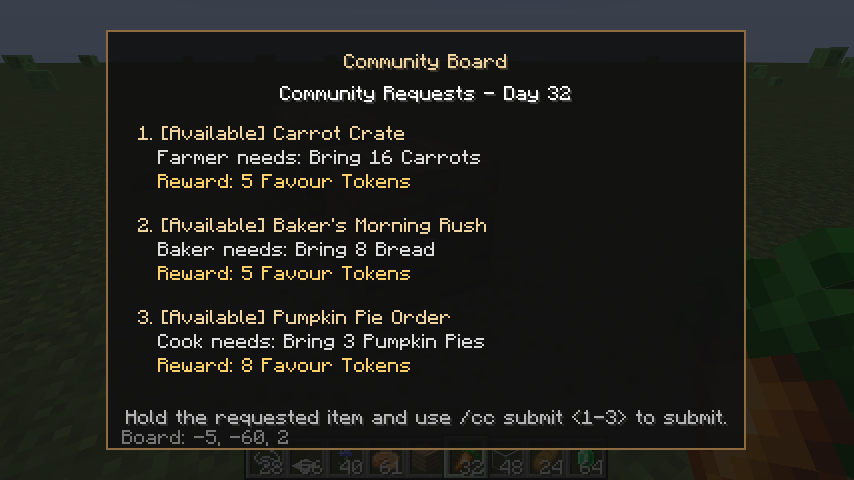

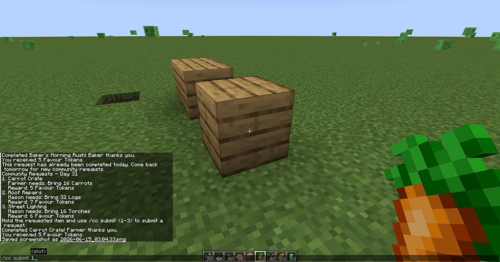

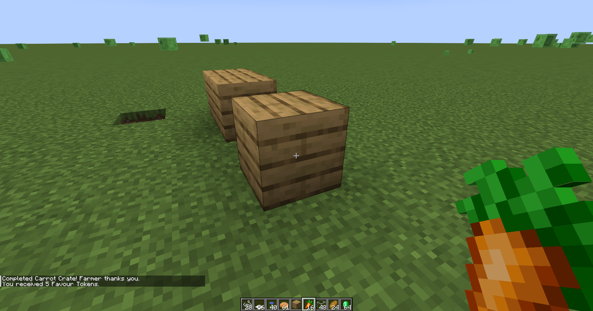

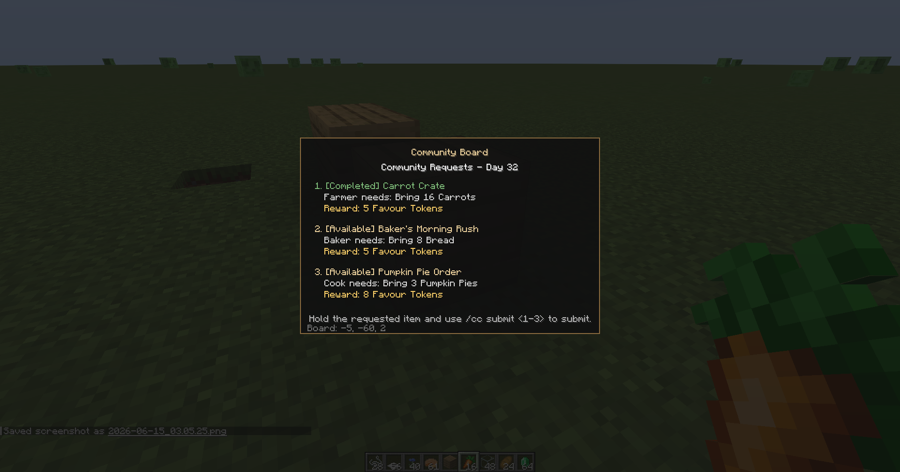

### Next step

Add server-authoritative submit controls to the board GUI while continuing to use the shared submission backend.

## Milestone 12 — GUI Submit Buttons

### Goal

Allow players to submit a specific active request directly from the Community Board GUI while keeping all contract processing authoritative on the server.

### What was implemented

* Added one Submit button to each active contract entry.
* Disabled the button when its contract is already completed.
* Added a client-to-server packet containing the board position and zero-based contract slot.
* Validated the player, board position, interaction distance, and selected slot on the server.
* Reused `ContractSubmissionService` for held-item validation, consumption, rewards, and completion state.
* Refreshed the GUI with current board data after a valid submission request.
* Preserved command and shift-right-click submission.

### Why it mattered

The GUI now supports the complete request-and-reward loop without duplicating gameplay rules or trusting client-provided results. Commands, world interaction, and GUI controls all use the same submission backend.

### Challenges / fixes

* Kept the buttons lightweight without introducing menu or inventory slots.
* Added proximity and block identity checks before accepting a client request.
* Reused the existing screen packet to refresh completed status instead of adding a larger synchronization system.

### Screenshots

Screenshots will be added after in-game testing.

### Next step

Improve the Community Board's presentation and visual assets before expanding into reward-shop features.

## Milestone 13 — Inventory-Based GUI Submission

### Goal

Make GUI and command submission convenient by finding requested items across the player's inventory while preserving shift-right-click as an optional physical hand-in interaction.

### What was implemented

* Added a dedicated full-inventory contract slot submission path.
* Updated GUI Submit buttons to check all player inventory stacks.
* Updated `/cozycontracts submit <slot>` and `/cc submit <slot>` to use full-inventory submission.
* Counted exact-item requirements across multiple matching stacks.
* Allowed tag requirements to combine different matching items, such as mixed small flowers.
* Removed exactly the required total only after confirming enough matching items were available.
* Kept shift-right-click submission held-item-only.
* Reused the existing reward, completion, and player message logic.

### Why it mattered

Held-item submission was useful for proving the backend before the GUI existed. Once Submit buttons were added, closing the board and arranging the requested item in the main hand became tedious. Full-inventory GUI and command submission makes the board much easier to use, while shift-right-click remains available for players who prefer the direct hand-in interaction.

### Challenges / fixes

* Used a count-first approach so an unsuccessful submission never removes partial items.
* Removed items across stacks without exceeding the requested count.
* Supported mixed stacks for tag requirements without adding partial contract progress storage.
* Kept the held-stack and inventory submission paths separate so their intended behavior remains clear.

### Screenshots

Screenshots will be added after in-game testing.

### Next step

Improve Community Board visuals and feedback before beginning reward-shop work.

## Milestone 14 — Community Board Visual Polish

### Goal

Improve the Community Board's presentation and make its GUI easier to scan without changing any gameplay behavior.

### What was implemented

* Added horizontal facing so the board turns toward the player when placed.
* Replaced the full-cube model with a thin wooden notice board and supporting posts.
* Added simple pixel-art textures for the board front, sides, and posts.
* Updated blockstate rotations and collision shape to match the board's facing.
* Improved GUI title and row spacing.
* Made available and completed states easier to distinguish.
* Dimmed completed contract details and kept completed Submit buttons disabled.
* Clarified reward colors and the bottom inventory-submission instruction.
* Preserved the existing BlockEntity, submission paths, commands, and persistence behavior.

### Why it mattered

The Community Board is the central interaction point for the mod. Giving it a recognizable notice-board silhouette and improving the screen hierarchy makes the prototype feel more intentional and easier to use while staying close to Minecraft's visual language.

### Challenges / fixes

* Kept the model simple enough to rotate cleanly in all four horizontal directions.
* Matched the interaction shape to the thinner model instead of leaving full-cube collision.
* Focused only on presentation and usability so gameplay logic remained unchanged.

### Screenshots

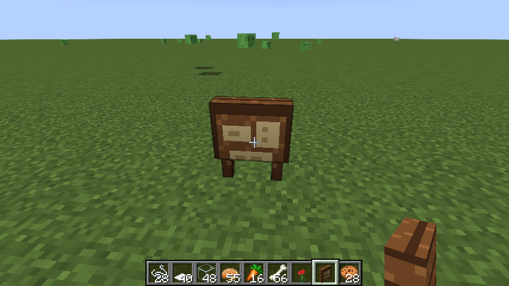

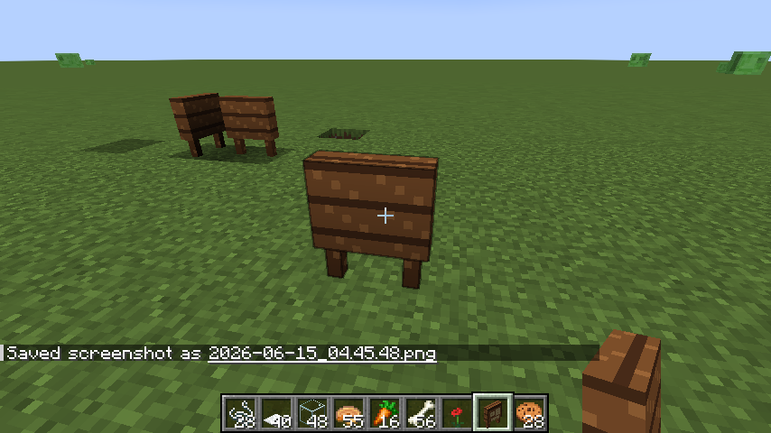

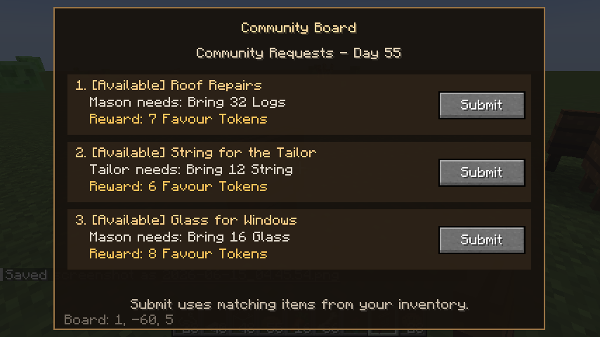

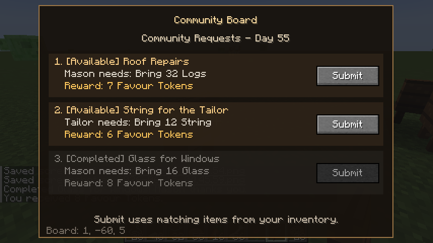

### Next step

Replace or refine the placeholder pixel art after visual testing, then begin the next gameplay milestone.

## Milestone 15 — Basic Favour Token Reward Shop

### Goal

Complete the first MVP gameplay loop by giving players a useful way to spend the Favour Tokens earned from community requests.

### What was implemented

* Added a Java-defined shop item model and registry.
* Added eight fixed vanilla rewards with individual Favour Token prices.
* Added server-side token counting and removal across multiple inventory stacks.
* Added server-authoritative purchase validation and reward delivery.
* Dropped purchased rewards near the player if their inventory was full.
* Added Requests and Shop sections to the Community Board GUI.
* Added Buy buttons for each available reward.
* Kept request submission, commands, shift-right-click hand-in, contract loading, and board persistence unchanged.

### Why it mattered

Players can now complete contracts, earn Favour Tokens, and spend those tokens on useful vanilla rewards. This closes the first complete MVP progression loop and gives contract completion an immediate purpose beyond accumulating currency.

### Challenges / fixes

* Kept purchases entirely server-side so the client cannot grant rewards or choose prices.
* Used atomic inventory payment so unaffordable purchases never remove partial token stacks.
* Kept shop stock Java-defined for this first version to avoid coupling it to contract JSON loading.
* Used a compact two-column layout so all rewards remain readable without item icons or inventory slots.

### Screenshots

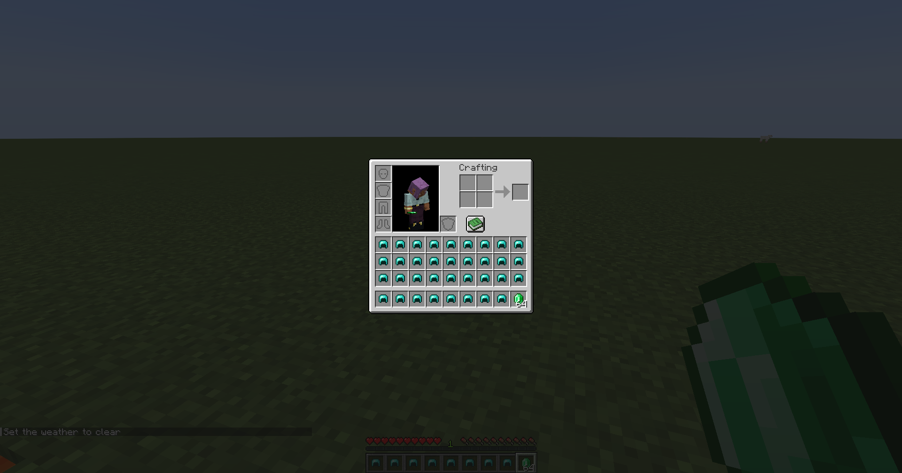

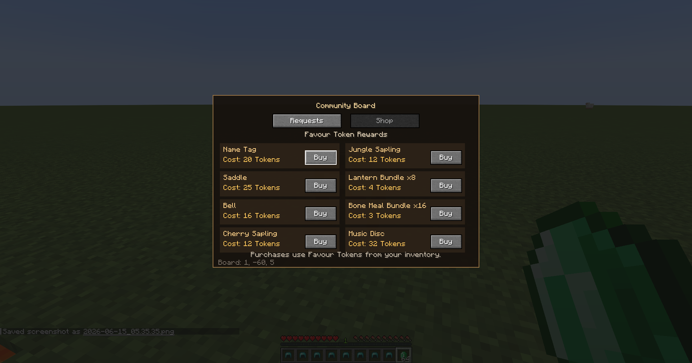

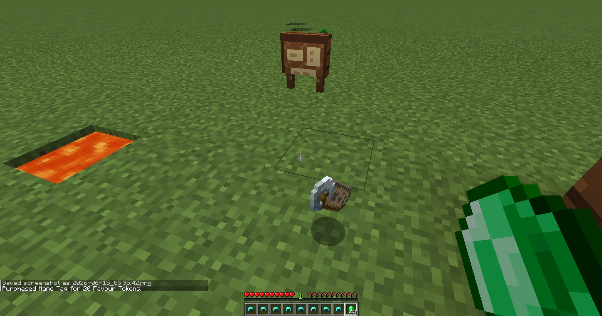

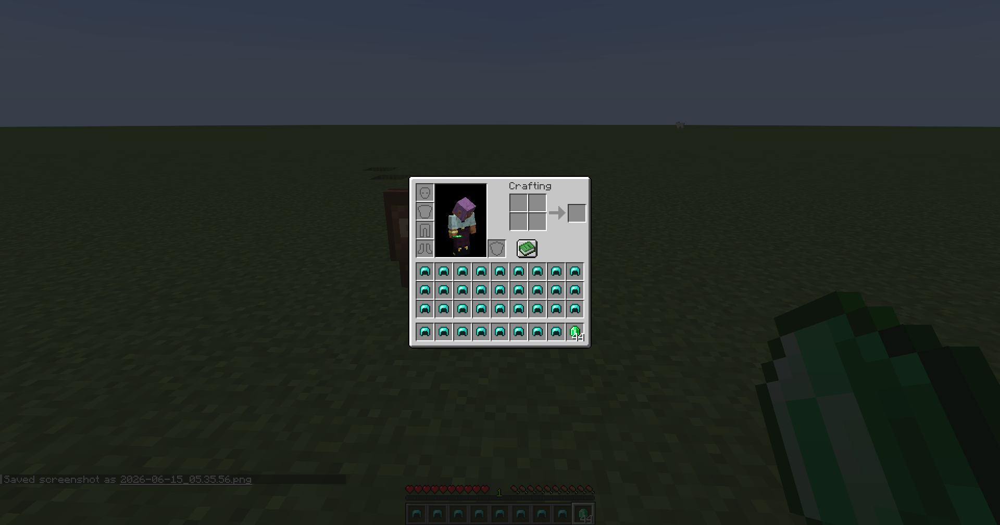

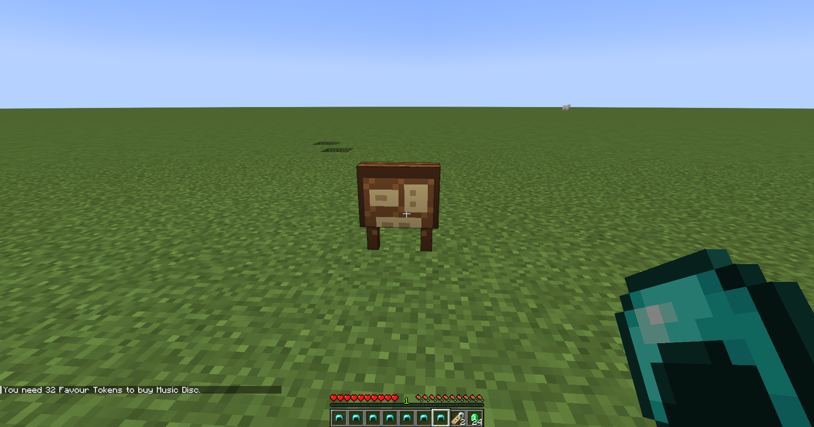

[Watch the reward system and shop showcase](screenshots/15-basic-favour-token-reward-shop/showcase-reward-system-and-shop.mp4)

### Next step

Evaluate the MVP economy and shop usability before considering JSON-driven stock, rotating rewards, or village-themed shops.

## Milestone 16 — Settlement Foundation Lite

### Goal

Add the smallest possible settlement identity layer so a Community Board can answer which settlement it belongs to.

### What was implemented

* Added a settlement data model with an ID, center position, dimension identity, and created day.
* Added dimension-local saved data so settlement identities persist through save and reload.
* Added a lookup rule that reuses an existing settlement center within 64 blocks.
* Created a new settlement centered on the board when no nearby settlement exists.
* Added `/cozycontracts debug settlement` and `/cc debug settlement`.
* Updated board debug output to include settlement ID and center position.
* Kept active contract IDs and completed contract IDs stored on the board BlockEntity for now.

### Why it mattered

The Community Board can now resolve to a stable settlement identity without changing the current contract, shop, or completion loop. Nearby boards can resolve to the same settlement later, which prepares the architecture for future districts, Prosperity, Village Bond, and settlement networks.

### Challenges / fixes

* Kept the saved data intentionally small so it does not become a hidden gameplay system too early.
* Ignored invalid saved entries during load instead of crashing a world.
* Left gameplay logic unchanged so contract selection remains board/day-based.

### Screenshots

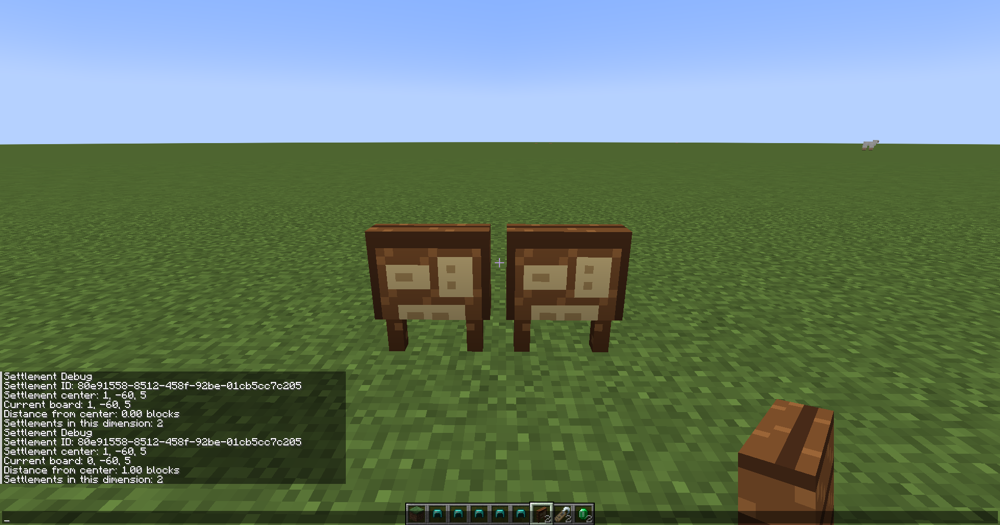

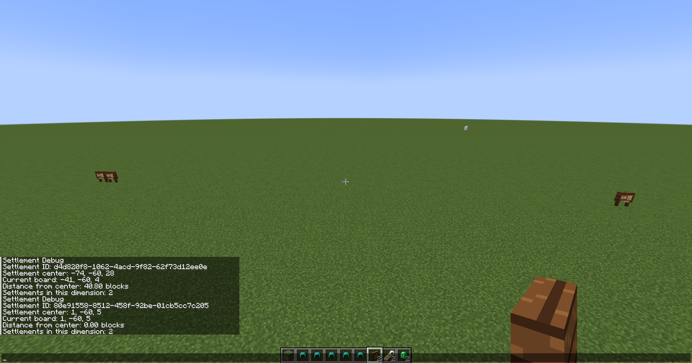

### Next step

Use the settlement identity as a foundation for future category-ready shop data while keeping districts and progression systems out of the current MVP.

## Milestone 17 — Category-Ready Shop Items

### Goal

Prepare the Java-defined reward shop for future themed and district-based stock without changing the current shop experience.

### What was implemented

* Added a `ShopCategory` enum for universal and future village themes.
* Updated shop items to store immutable category metadata.
* Assigned categories to the current eight vanilla reward items.
* Added `/cozycontracts debug shop` and `/cc debug shop`.
* Kept the Shop tab showing all existing rewards.
* Kept shop prices, rewards, and purchase logic unchanged.

### Why it mattered

Shop items now carry enough metadata to support future district and themed stock decisions. This supports the long-term village and settlement design while keeping the current MVP shop simple and predictable.

### Challenges / fixes

* Added categories as data only, with no settlement filtering yet.
* Kept reward stack copying and purchase safety unchanged.
* Preserved the current GUI behavior so every existing shop item remains visible and purchasable.

### Screenshots

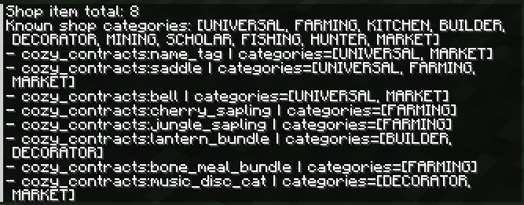

### Next step

Use the category metadata to begin a themed shop foundation later, without adding rotating stock or settlement filtering yet.

## Milestone 18 — Farmer's Delight Compatibility Contracts

### Goal

Add optional Farmer's Delight contracts that expand the cooking and farming request pool when Farmer's Delight is installed.

### What was implemented

* Added Farmer's Delight contracts as JSON contract files.
* Added `required_mods: ["farmersdelight"]` to every Farmer's Delight contract.
* Focused the new contracts on kitchen and farming requests.
* Used verified Farmer's Delight 1.20.1 item IDs from the installed mod jar.
* Kept Cozy Contracts standalone with no Java imports or mandatory dependency on Farmer's Delight.

### Why it mattered

The existing JSON contract loader can now support optional food-mod compatibility without adding hard dependencies. Players who install Farmer's Delight get more cozy cooking and farming requests, while players without it keep the standalone vanilla experience.

### Challenges / fixes

* Verified the `farmersdelight` mod ID and item registry IDs before writing JSON.
* Avoided suggested item IDs that were not present in the installed 1.20.1 jar.
* Kept contract loading, selection, shop behavior, settlement behavior, and GUI behavior unchanged.

### Screenshots

Screenshots will be added after in-game testing.

### Next step

Test the optional contracts in a runtime with Farmer's Delight installed, then consider Create: Food compatibility contracts later.

## Milestone 19 — Themed Shop Foundation

### Goal

Begin separating shop stock by category while keeping the current reward shop simple and stable.

### What was implemented

* Added a shop stock service that can resolve visible shop items from category data.
* Added temporary MVP board shop categories: `UNIVERSAL`, `FARMING`, and `KITCHEN`.
* Kept current MVP shop rewards visible through a compatibility rule while real district filtering is not implemented.
* Updated the Community Board Shop tab to use board-resolved shop stock.
* Updated shop purchase validation so the server checks that the requested item is available in the current board's shop stock.
* Expanded the debug shop command to show registered items, known categories, and board-visible stock when looking at a Community Board.

### Why it mattered

Shop items can now be resolved through a stock layer instead of every screen or packet assuming the full registry is always visible. This prepares the reward shop for future settlement and district-themed stock without changing the current player experience.

### Challenges / fixes

* The temporary `FARMING` + `KITCHEN` board rule is only a placeholder, not the final settlement theme system.
* Some current MVP rewards belong to future categories such as Builder, Decorator, and Market, so the first stock service keeps all current rewards visible until real district-based filtering exists.
* Purchase validation now checks board stock availability server-side so hidden future stock cannot be bought by packet ID.

Long term, settlement shop categories should be shaped by player-built districts, supplied items, completed contracts, and other settlement development signals, not chosen once when the board is placed.

### Screenshots

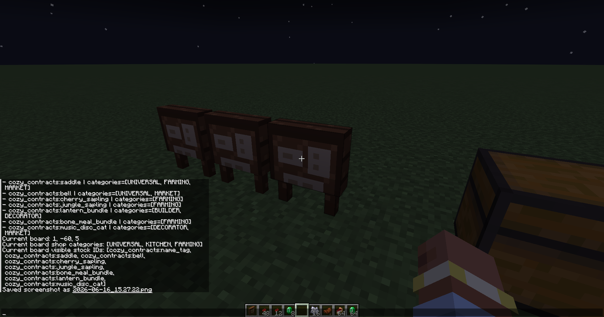

### Next step

Use the stock service as the foundation for future themed village shops, then add settlement or district signals only when those systems are ready.

## Milestone 20 — Community Kitchen Foundation

### Goal

Create the first visible foundation for cooking-focused gameplay without adding food hand-in, rewards, or economy changes.

### What was implemented

* Added a small Community Kitchen data model for display-only orders.
* Added `DAILY_MENU`, `STANDING_ORDER`, and `FEAST_PREP` kitchen order types.
* Added initial vanilla-safe Daily Menu and Standing Order examples.
* Added a board kitchen service that returns the orders a Community Board should display.
* Added read-only Kitchen data to the Community Board screen packet.
* Added a third Community Board GUI tab: Requests, Shop, and Kitchen.
* Added `/cozycontracts debug kitchen` and `/cc debug kitchen`.

### Why it mattered

The Community Board can now show a cooking-focused space without changing contract submission, shop purchases, or the token economy. This gives the future Community Kitchen, Daily Menu, Standing Orders, and food mod integration a visible foundation while keeping the current gameplay stable.

### Challenges / fixes

* Kept the Kitchen tab read-only, with no food submission, rewards, caps, or resident preferences.
* Sent only display text to the client instead of item stacks or recipe data.
* Kept every board showing the same small order set for now, with no settlement, district, or daily random filtering.
* Polished the read-only Kitchen tab into separate Daily Menu and Standing Orders columns so the example orders are easier to scan.
* Preserved existing Requests and Shop tab behavior.

### Screenshots

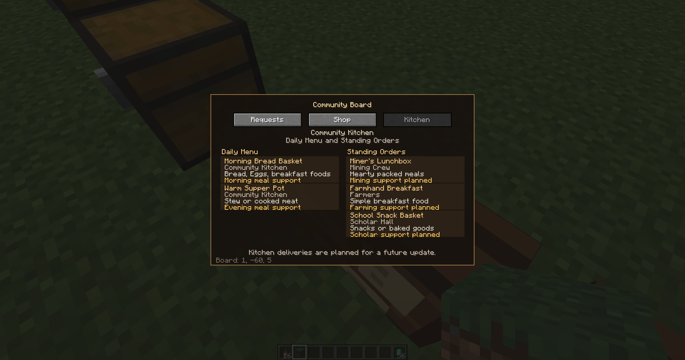

### Next step

Test the read-only Kitchen tab in-game, then decide the smallest safe path toward future cooking deliveries, caps, and food mod support.

## Milestone 21 — Kitchen Deliveries Foundation

### Goal

Make the Community Kitchen tab playable by allowing simple vanilla food deliveries without adding the future resident, taste, Prosperity, or Storehouse systems.

### What was implemented

* Added exact-item requirements, required counts, small Favour Token rewards, and daily delivery limits to Kitchen orders.
* Added server-side Kitchen delivery validation.
* Added full-inventory item counting and removal for Kitchen deliveries.
* Added per-board, per-day Kitchen delivery counts on the Community Board block entity.
* Added a Kitchen delivery packet from the GUI to the server.
* Added Deliver buttons, progress text, reward text, and disabled filled orders to the Kitchen tab.
* Updated `/cozycontracts debug kitchen` and `/cc debug kitchen` to show requirements, rewards, limits, and board delivery progress.

### Why it mattered

Kitchen orders can now accept simple vanilla food deliveries while staying separate from normal board contracts. This gives cooking its first small gameplay loop and prepares the system for future food mod integration without making Kitchen rewards stronger than daily contracts.

### Challenges / fixes

* Kept delivery validation server-authoritative so the client only requests an order ID.
* Removed required food only after confirming enough matching items exist.
* Kept rewards intentionally small because Kitchen deliveries are ongoing support, not the main daily contract economy.
* Reset delivery counts by Minecraft day without moving data into settlement storage yet.
* Left Resident Profiles, Taste Preferences, Prosperity, and Storehouse as future systems.

### Screenshots

[Watch the kitchen delivery showcase](screenshots/21-kitchen-deliveries-foundation/kitchen-delivery-showcase.mp4)

### Next step

Test Kitchen deliveries in Survival, then tune messages and caps before considering food mod support or resident preference systems.

## Milestone 22 — Kitchen Orders Data Foundation

### Goal

Refactor Kitchen order data so it is ready for future JSON/datapack loading and optional modded food requirements while keeping current Kitchen gameplay unchanged.

### What was implemented

* Updated Kitchen order requirements to use a data-ready model with requirement type, ID, count, and display text.
* Preserved exact-item Kitchen requirements for the current vanilla delivery orders.
* Added item-tag requirement support in the model for future Kitchen orders.
* Added stable registry lookup by Kitchen order ID.
* Added duplicate ID protection for Kitchen orders, keeping the first definition and logging a warning.
* Added requirement validation/debug text for easier future troubleshooting.
* Improved `/cozycontracts debug kitchen` and `/cc debug kitchen` output with requirement details.

### Why it mattered

Kitchen orders now use a structure closer to the data-driven contract system. This prepares the Kitchen for future JSON/datapack orders and optional modded food orders without adding Kitchen JSON loading yet.

### Challenges / fixes

* Kept existing Kitchen deliveries working with the same vanilla food requirements, rewards, and daily caps.
* Added tag-ready matching without adding new tag-based Kitchen content yet.
* Kept the registry simple and immutable so future loading can replace or extend it cleanly.
* Preserved the current Community Board tab when refreshed board data replaces the screen, so Kitchen deliveries keep the player on the Kitchen tab.
* Left Resident Profiles, Taste Preferences, Prosperity, and Storehouse as future systems.

### Screenshots

No screenshot needed, since gameplay and GUI appearance were unchanged.

### Next step

Test the refactored Kitchen orders in-game, then continue toward MVP polish or future Kitchen JSON loading when the format is ready.

## Milestone 23 — Kitchen Orders JSON Foundation

### Goal

Load Kitchen orders from JSON/datapack resources while keeping the current Kitchen delivery gameplay unchanged.

### What was implemented

* Added a Kitchen order JSON format under `data/<namespace>/kitchen_orders/`.
* Added a JSON reload listener for Kitchen orders.
* Added validation for required fields, order type, item requirements, rewards, daily limits, and optional `required_mods`.
* Moved the five existing vanilla Kitchen orders into built-in JSON resources.
* Updated the Kitchen order registry so JSON/datapack orders become the active source when valid orders load.
* Kept Java fallback Kitchen orders for safety if no valid JSON orders load.
* Updated `/cozycontracts debug kitchen` and `/cc debug kitchen` to show the active source.

### Why it mattered

Kitchen orders now follow the same data-driven direction as contracts. This prepares the Community Kitchen for future datapacks and optional Farmer's Delight or Create: Food Kitchen orders without adding new content yet.

### Challenges / fixes

* Preserved the existing five vanilla Kitchen orders, delivery requirements, rewards, and daily caps.
* Kept delivery counts, GUI refresh behavior, and server-side validation unchanged.
* Supported `required_mods` so future food mod Kitchen orders can be skipped safely when their mods are missing.
* Left Resident Profiles, Taste Preferences, Prosperity, and Storehouse as future systems.

### Screenshots

Screenshots will be added after in-game testing.

### Next step

Test Kitchen order reload behavior, then continue MVP polish before adding optional food mod Kitchen order content.

## Milestone 24 — Farmer's Delight Kitchen Orders

### Goal

Add optional Farmer's Delight Kitchen orders that make the Community Kitchen feel more like cooking-focused gameplay while keeping Cozy Contracts standalone.

### What was implemented

* Added optional Farmer's Delight Kitchen order JSON files.
* Added `required_mods: ["farmersdelight"]` to every Farmer's Delight Kitchen order.
* Verified the Farmer's Delight mod ID and item IDs before writing the JSON.
* Focused the order set mostly on cooked meals, lunch deliveries, soups, hearty meals, and a feast-style order.
* Added raw ingredient orders only as kitchen support orders.
* Kept the orders as JSON data with no Java dependency on Farmer's Delight.

### Why it mattered

The Community Kitchen now has a richer optional cooking-focused order pool when Farmer's Delight is installed. Players without Farmer's Delight keep the standalone vanilla Kitchen experience.

### Challenges / fixes

* Confirmed the mod ID is `farmersdelight`.
* Used only Farmer's Delight item IDs verified from the local 1.20.1 jar.
* Made Farmer's Delight an opt-in development runtime dependency with `-PenableFarmersDelight=true`, keeping standalone dev launches clean by default.
* Added optional JEI dev-runtime support with `-PenableJei=true` for recipe and item lookup testing without making JEI a dependency.
* Made the Kitchen tab scrollable so larger optional order pools stay inside the Community Board panel.
* Added compact Kitchen row progress text so delivery counts and token rewards fit beside the Deliver button.
* Added Kitchen row hover details for the full title, requester, type, requirement, progress, reward, and daily limit.
* Kept delivery refreshes on the Kitchen tab so repeated deliveries remain comfortable.
* Kept normal contracts, Kitchen loading, delivery logic, shop behavior, and settlement behavior unchanged.
* Left Resident Profiles, Taste Preferences, Prosperity, and Storehouse as future systems.

### Screenshots

Screenshots will be added after in-game testing.

### Next step

Test the optional Farmer's Delight Kitchen order pool in-game with the opt-in dev flag, then continue toward Create: Food compatibility or MVP polish.

## Milestone 25 — Create: Food Optional Contracts

### Goal

Add optional Create: Food Community Board contracts while keeping Cozy Contracts standalone and free of hard Create or Create: Food dependencies.

### What was implemented

* Added optional Create: Food board contract JSON files under `data/cozy_contracts/contracts/`.
* Added `required_mods: ["createfood"]` to every Create: Food contract so they are skipped safely when Create: Food is not installed.
* Added an opt-in `enableCreateFood` Gradle property for development runtime testing.
* Included Create as part of the Create: Food dev runtime toggle because Create: Food declares it as a mandatory dependency.
* Verified the Create: Food mod ID and item IDs from the local resolved jar before writing contract data.
* Focused the contracts on chocolate prep, dough supplies, waffles, pizza, sandwiches, breakfast plates, cheesecake, donuts, and dessert table requests.

### Why it mattered

This milestone proves the JSON contract system can support another food mod without adding Java imports or mandatory dependencies. It also broadens normal Community Board food gameplay beyond vanilla and Farmer's Delight while leaving Kitchen order content for a later step.

### Challenges / fixes

* Confirmed the Create: Food mod ID is `createfood`.
* Confirmed Create: Food requires Create at runtime, while Create bundles its required Flywheel and Ponder jars.
* Used only Create: Food item IDs verified from the resolved 1.20.1 jar.
* Kept contract loading, Kitchen deliveries, shop behavior, settlement behavior, and Farmer's Delight values unchanged.
* Did not add Create: Food Java imports, mandatory `mods.toml` dependencies, Kitchen orders, Resident Profiles, Taste Preferences, Prosperity, or Storehouse systems.

### Screenshots

Screenshots will be added after in-game testing.

### Next step

Test standalone, Create: Food, and full optional food-mod development runtimes, then continue toward MVP polish or future Create: Food Kitchen orders.

## Milestone 26 - MVP Release Candidate Polish

### Goal

Prepare Cozy Contracts for a 0.1.0-alpha release candidate by tightening release-facing documentation and checking small release-readiness issues without adding new gameplay systems.

### What was checked / fixed

* Fixed the Community Board crafting recipe so JEI no longer shows an empty `minecraft:sticks` tag.
* Cleaned documentation for the 0.1.0-alpha release candidate.
* Updated release-facing wording for standalone play and optional food-mod setups.
* Clarified current alpha features, known limitations, and future systems.
* Added release notes for the first alpha candidate.

### Why it mattered

The project now has a complete first gameplay loop: Community Board requests, Favour Tokens, the reward shop, Community Kitchen deliveries, JSON/datapack content, optional Farmer's Delight content, and optional Create: Food board contracts. Release documentation needs to describe what is playable now, what is optional, and what remains future work.

### Challenges / fixes

* Kept standalone Cozy Contracts clearly separate from optional Farmer's Delight, Create, Create: Food, and JEI setups.
* Marked Resident Profiles, Taste Preferences, Prosperity, Storehouse, Village Bond, Community Projects, and Village Network as future systems.
* Kept this milestone focused on release preparation and documentation; no new gameplay systems were added.

### Screenshots / media

No new screenshots were added for this documentation milestone.

### Next step

Test the built jar in a fresh Forge 1.20.1 instance, then prepare the GitHub alpha release.

## Current Status

Cozy Contracts is a 0.1.0-alpha release candidate with a complete first gameplay loop and a light settlement identity foundation. Players can complete data-driven contracts, earn Favour Tokens, and spend them on vanilla rewards through the Community Board shop. Optional Farmer's Delight JSON contracts, optional Farmer's Delight Kitchen orders, and optional Create: Food JSON contracts are available when those mods are installed, with opt-in Gradle properties for development runtime testing. Shop stock now resolves through a category-aware foundation while keeping the current MVP rewards visible. The Community Board also has a scrollable Kitchen tab with JSON-loaded food deliveries, small rewards, and per-board daily caps.

The long-term design direction now frames the Community Board as the main interface to a broader settlement system with districts, themed shops, Community Kitchen support, Standing Orders, Resident Profiles, Taste Preferences, Community Supplies, Prosperity, Village Bond, Community Projects, and village networks.

## Next Planned Work

1. Test built jar in a fresh Forge 1.20.1 instance.
2. Test standalone.
3. Test with Farmer's Delight.
4. Test with Create + Create: Food.
5. Test with Farmer's Delight + Create + Create: Food + JEI.
6. Prepare GitHub release.
7. Prepare Modrinth/CurseForge alpha pages if desired.
8. Later: Create: Food Kitchen orders, residents, taste preferences, Prosperity, Storehouse, Village Bond, Community Projects, Village Network.
